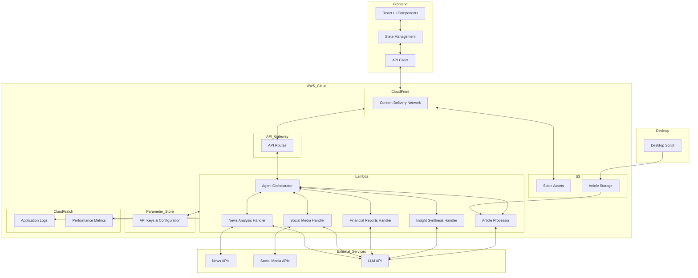
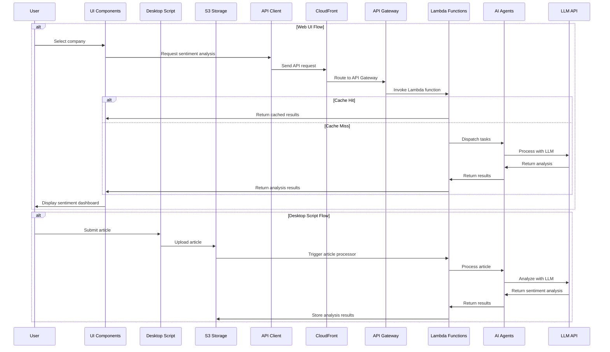
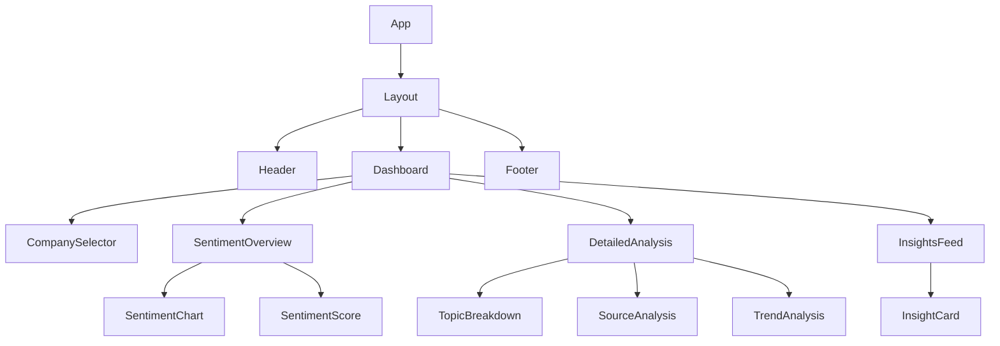
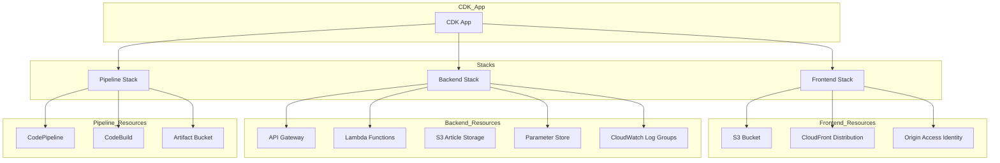

# System Patterns: Hiive AI Market Sentiment Analyzer

## System Architecture

The Hiive AI Market Sentiment Analyzer follows a modern, serverless architecture designed to showcase best practices while remaining implementable within a 1-2 day timeframe and deployable using AWS CDK.

## Key Technical Decisions

1. **Frontend Framework**: React with TypeScript and Vite
   - Aligns with Hiive's tech stack preferences
   - Provides type safety and better developer experience
   - Enables rapid development with component reusability
   - Vite offers fast build times and modern development experience

2. **Backend Implementation**: AWS Lambda with Express
   - Serverless functions that scale automatically
   - Express adapter for familiar API development
   - Cost-effective for demo applications
   - Easily deployable with AWS CDK

3. **State Management**: React Context + Hooks
   - Lightweight solution appropriate for demo scope
   - Avoids overhead of Redux for a smaller application
   - Maintains clean component architecture

4. **Styling Approach**: Tailwind CSS
   - Enables rapid UI development
   - Provides consistent design system
   - Aligns with modern frontend practices

5. **AI Integration**: LangChain.js
   - Provides tools for building AI agent workflows
   - Simplifies integration with LLM APIs
   - Enables complex agent interactions

6. **Data Visualization**: Recharts
   - React-native charting library
   - Customizable and responsive
   - Lightweight with good performance

7. **Infrastructure as Code**: AWS CDK
   - Define infrastructure using TypeScript
   - Consistent language across application and infrastructure
   - Enables infrastructure testing and validation
   - Provides repeatable deployments

8. **Desktop Script**: Node.js CLI Application
   - Enables article submission from desktop environment
   - Provides simple interface for users to submit articles
   - Integrates with S3 for storage

9. **Storage Solution**: Amazon S3
   - Cost-effective, scale-to-zero storage for articles
   - Pay only for what you use with no minimum fees
   - Integrates seamlessly with Lambda for processing
   - Supports lifecycle policies for automatic cleanup

## Design Patterns in Use

### Frontend Patterns

1. **Component Composition**
   - Build complex UI from simple, reusable components
   - Maintain clear separation of concerns
   - Enable consistent styling and behavior

2. **Custom Hooks**
   - Encapsulate and reuse stateful logic
   - Separate data fetching from presentation
   - Improve testability

3. **Container/Presentational Pattern**
   - Separate data management from rendering
   - Improve component reusability
   - Simplify testing

### Backend Patterns

1. **Serverless Architecture**
   - Implement backend logic in Lambda functions
   - Scale automatically based on demand
   - Reduce operational complexity

2. **Agent-Based Architecture**
   - Delegate specific tasks to specialized AI agents
   - Enable parallel processing of different data sources
   - Maintain separation of concerns

3. **Orchestrator Pattern**
   - Coordinate multiple agents
   - Manage workflow and dependencies
   - Handle error cases and retries

4. **Caching Strategy**
   - Cache expensive AI operations
   - Improve response times for repeated queries
   - Reduce API costs

5. **Event-Driven Processing**
   - Process articles asynchronously as they arrive in S3
   - Decouple submission from processing
   - Enable scalable, resilient workflow

### AI Agent Patterns

1. **Chain of Thought Prompting**
   - Guide LLMs through complex reasoning tasks
   - Improve accuracy of sentiment analysis
   - Enable transparent decision-making

2. **Retrieval-Augmented Generation (RAG)**
   - Enhance LLM responses with retrieved context
   - Provide up-to-date information about companies
   - Reduce hallucinations

3. **Agent Specialization**
   - Create purpose-built agents for specific tasks
   - Optimize prompts for different data sources
   - Enable parallel processing

### Infrastructure Patterns

1. **Infrastructure as Code**
   - Define all infrastructure components in TypeScript using AWS CDK
   - Enable version control of infrastructure
   - Facilitate reproducible deployments

2. **Immutable Infrastructure**
   - Create new resources rather than modifying existing ones
   - Improve reliability and consistency
   - Enable rollback to previous states

3. **Least Privilege Access**
   - Grant minimal permissions required for each component
   - Improve security posture
   - Follow AWS security best practices

4. **Configuration Externalization**
   - Store configuration in Parameter Store
   - Separate configuration from code
   - Enable environment-specific settings

## Component Relationships

### Data Flow

### Component Hierarchy

## AWS CDK Infrastructure

This architecture balances sophistication with practicality, enabling a compelling demonstration of AI capabilities while remaining feasible to implement within the 1-2 day timeframe and deployable using AWS CDK.