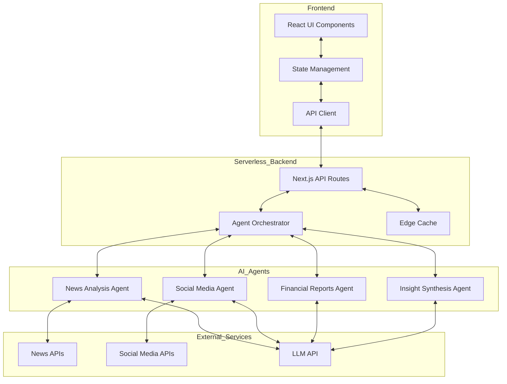
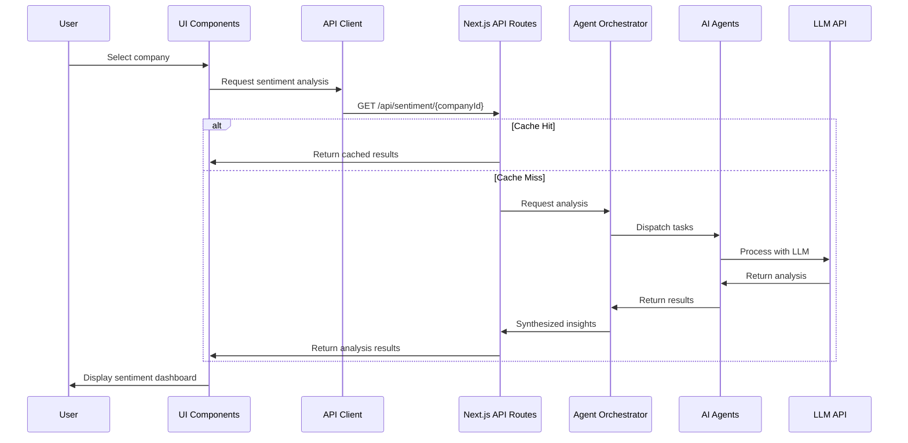
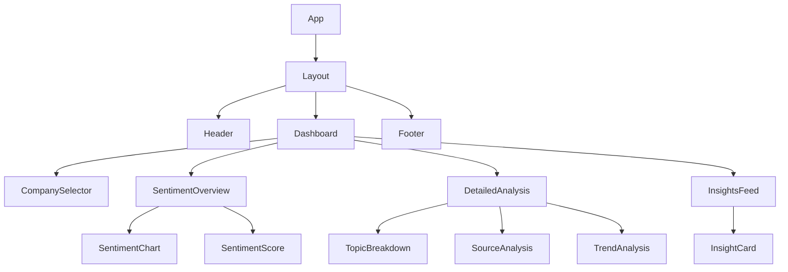
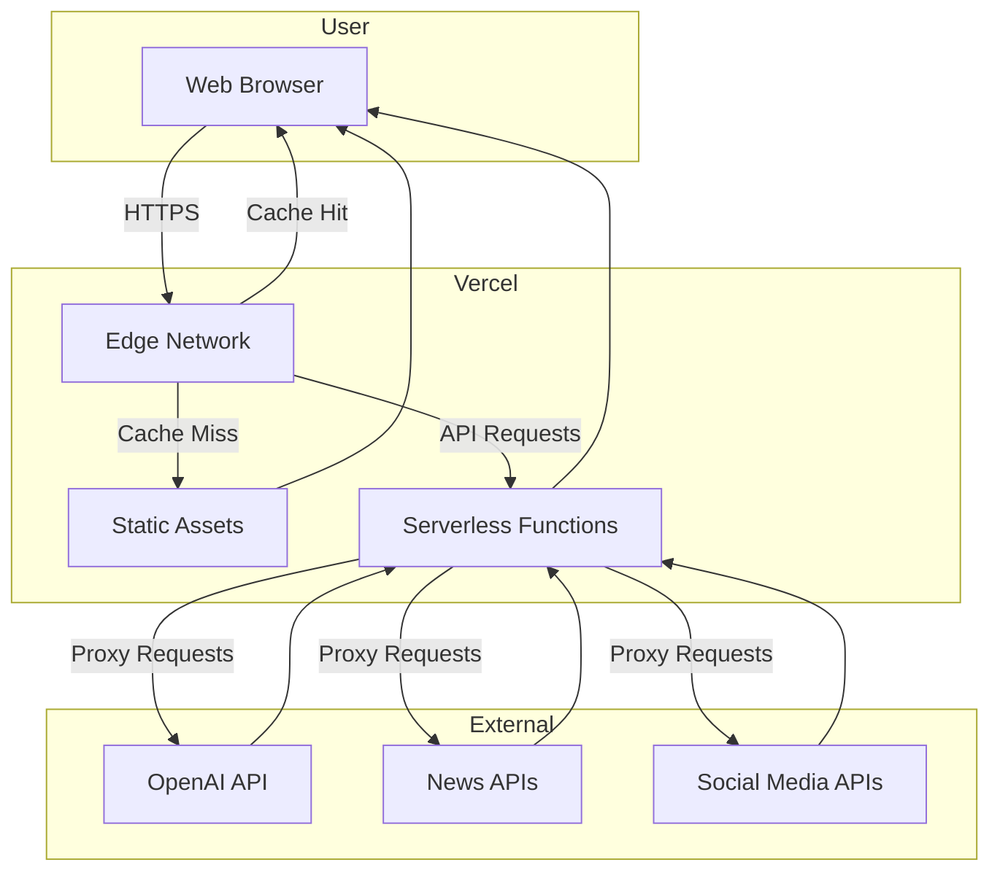

# System Patterns: Hiive AI Market Sentiment Analyzer

## System Architecture

The Hiive AI Market Sentiment Analyzer follows a modern, scalable architecture designed to showcase best practices while remaining implementable within a 1-2 day timeframe and deployable to Vercel.

## Key Technical Decisions

1. **Frontend Framework**: Next.js with React and TypeScript
   - Aligns with Hiive's tech stack preferences
   - Provides built-in API routes for serverless backend
   - Enables seamless deployment to Vercel
   - Offers improved performance with SSR/SSG capabilities

2. **Backend Implementation**: Next.js API Routes
   - Serverless functions that scale automatically
   - Eliminates need for separate backend server
   - Simplifies deployment process
   - Enables secure handling of API keys

3. **State Management**: React Context + Hooks
   - Lightweight solution appropriate for demo scope
   - Avoids overhead of Redux for a smaller application
   - Maintains clean component architecture

4. **Styling Approach**: Tailwind CSS
   - Enables rapid UI development
   - Provides consistent design system
   - Aligns with modern frontend practices

5. **AI Integration**: LangChain.js
   - Provides tools for building AI agent workflows
   - Simplifies integration with LLM APIs
   - Enables complex agent interactions

6. **Data Visualization**: Recharts
   - React-native charting library
   - Customizable and responsive
   - Lightweight with good performance

7. **Deployment Platform**: Vercel
   - Optimized for Next.js applications
   - Provides serverless functions for backend logic
   - Offers global CDN for improved performance
   - Simplifies environment variable management

## Design Patterns in Use

### Frontend Patterns

1. **Component Composition**
   - Build complex UI from simple, reusable components
   - Maintain clear separation of concerns
   - Enable consistent styling and behavior

2. **Custom Hooks**
   - Encapsulate and reuse stateful logic
   - Separate data fetching from presentation
   - Improve testability

3. **Container/Presentational Pattern**
   - Separate data management from rendering
   - Improve component reusability
   - Simplify testing

4. **Static Site Generation (SSG) / Server-Side Rendering (SSR)**
   - Leverage Next.js capabilities for improved performance
   - Pre-render pages where possible
   - Use dynamic imports for code splitting

### Backend Patterns

1. **Serverless Functions**
   - Implement backend logic in Next.js API routes
   - Scale automatically based on demand
   - Reduce operational complexity

2. **Agent-Based Architecture**
   - Delegate specific tasks to specialized AI agents
   - Enable parallel processing of different data sources
   - Maintain separation of concerns

3. **Orchestrator Pattern**
   - Coordinate multiple agents
   - Manage workflow and dependencies
   - Handle error cases and retries

4. **Edge Caching**
   - Cache expensive operations at the edge
   - Improve response times for repeated queries
   - Reduce API costs

### AI Agent Patterns

1. **Chain of Thought Prompting**
   - Guide LLMs through complex reasoning tasks
   - Improve accuracy of sentiment analysis
   - Enable transparent decision-making

2. **Retrieval-Augmented Generation (RAG)**
   - Enhance LLM responses with retrieved context
   - Provide up-to-date information about companies
   - Reduce hallucinations

3. **Agent Specialization**
   - Create purpose-built agents for specific tasks
   - Optimize prompts for different data sources
   - Enable parallel processing

## Component Relationships

### Data Flow

### Component Hierarchy

## Deployment Architecture

This architecture balances sophistication with practicality, enabling a compelling demonstration of AI capabilities while remaining feasible to implement within the 1-2 day timeframe and deployable to Vercel.